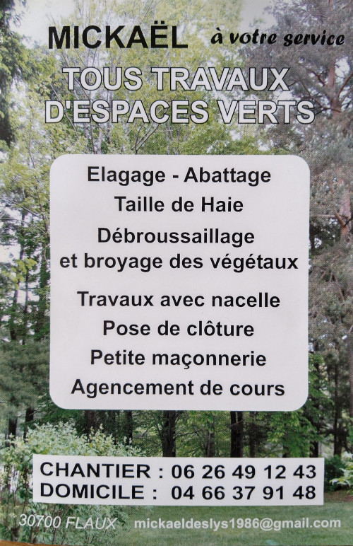

Si votre activité et votre siège social sont basés sur Flaux et vous souhaitez être répertoriés ci-dessous, merci de nous envoyer une demande: secretariat@mairie-flaux.fr

# Boulangerie Pâtisserie
Rémy va travailler avec des matières locales, et bio, levain naturel fabriqué par ses soins, il fera différents pains, viennoiseries, pâtisseries, commandes pour les évènements festifs, et très prochainement mise en place des pizzas à emporter également bio et produits locaux. 
Note: Pour le respect de tous, nous vous demandons de porter le masque à l'intérieur de notre jolie petite boulangerie comme nous le portons depuis hier, nous vous remercions de votre soutien!  
Rémy et Suzy

{:class="img-responsive"}
{:class="img-responsive"}

# [Suivez nous sur Facebook](https://www.facebook.com/EpisFlute/)

# Vgtaldeco atelier d'art végétal japonais les kokedamas 
185 chemin de collias à FLaux 
+33 (0)4 66 22 06 56 

{:class="img-responsive"}

# Ateliers Schuch - Alexandra Schuch  
Sculpteur, activité artistique relevant des arts plastiques.   
Sculpture - peinture - décoration intérieure et extérieure - métal - céramique - verre.... 
+33 (0)6 05 46 61 85   
alexandrasculpture@gmail.com  
Instagram: alexandra.schuch  

{:class="img-responsive"}

# Mickaël - Tous travaux d'espaces verts  
Elagage, Abattage, Taille de haie, Débroussaillage et broyage des végétaux, travaux avec nacelle, pose de clôture, petite maçonnerie, agencement de cours 

+33 (0)6 26 49 12 43   
+33 (0)4 66 37 91 48   
mickaeldeslys1986@gmail.com  

{:class="img-responsive"}

