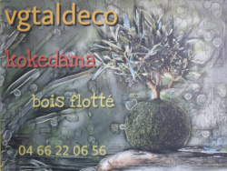
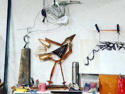

Si votre activité et votre siège social sont basés sur Flaux et vous souhaitez être répertoriés ci-dessous, merci de nous envoyer une demande: secretariat@mairie-flaux.fr

# Vgtaldeco atelier d'art végétal japonais les kokedamas 
185 chemin de collias à FLaux
T: 04 66 22 06 56

{:class="img-responsive"}

# Ateliers Schuch - Alexandra Schuch  
Sculpteur, activité artistique relevant des arts plastiques.   
Sculpture - peinture - décoration intérieure et extérieure - métal - céramique - verre.... 
+33 (0)6 05 46 61 85   
alexandrasculpture@gmail.com  
Instagram: aleandra.schuch  

{:class="img-responsive"}
