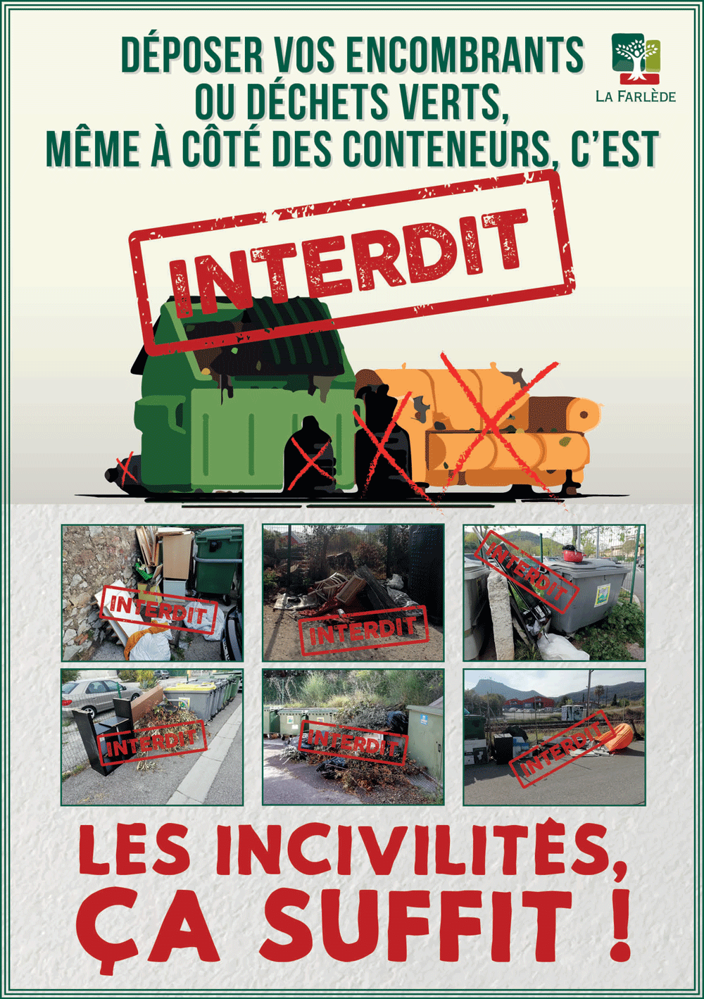

# Collecte sélective:

* Pour protéger notre environnement, pour respecter les directives européennes et pour maîtriser le coût d’élimination de nos déchets, 4 gestes simples sont à accomplir:  
1._Utiliser les colonnes de tri_ 
2._Aller à la déchèterie pour les encombrants ou toxiques_  
3._Utiliser son composteur individuel_ 
4._Déposer le RESTE (RESidus des Tris Effectués) dans votre bac individuel_ 

* COLLECTE Flaux - JEUDI

* NOUVEAUX ARRIVANTS : Un « Kit des nouveaux arrivants » est disponible en mairie

* Les sites SICTOMU les plus proches: Déchèterie de Vallabrix, Déchèterie d’Uzès Pont des charrettes
Tous renseignements sur le site du <a href="http://www.sictomu.org">SICTOMU</a>

## PROPRÉTAIRES DE LOCATIONS: 
Il est demandé d'effectuer un rappel sur les consignes de tri aux locataire ainsi qu'à nos invités. C'est pour cela que nous préconisons un affichage des consignes de tri du SICTOMU

{:class="img-responsive"}

