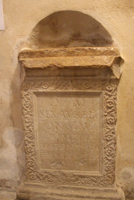
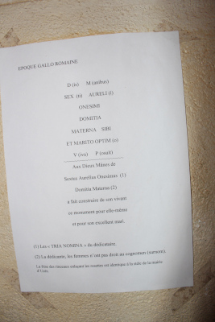
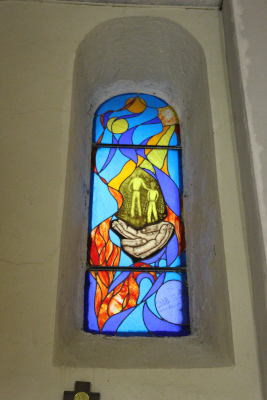
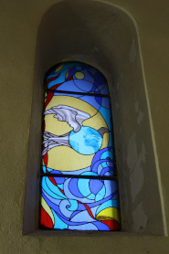
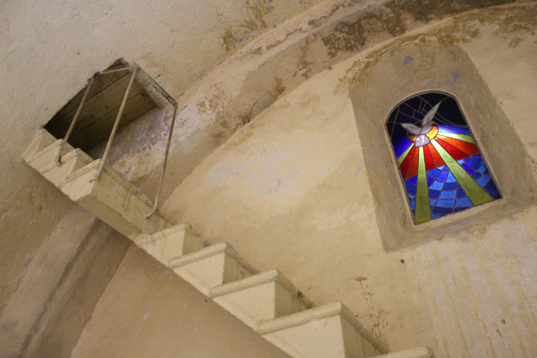
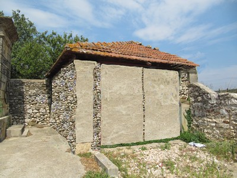
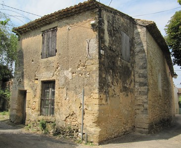
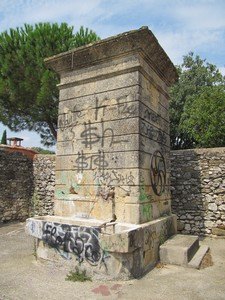
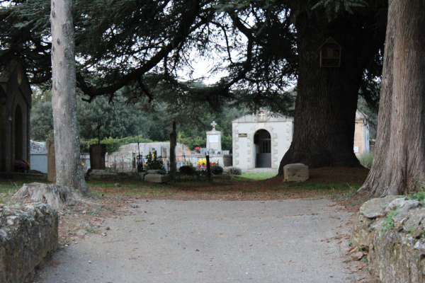

# Pour les randonneurs:  
[Visorando](https://www.visorando.com/randonnee-flaux.html "parcours") 
[Uzes Veloclub](https://www.uzesveloclub.fr/) 
[Rando Gard](https://rando.gard.fr/) 

# Offre touristique à proximité:   
[Pont du Gard](http://www.pontdugard.fr)  
[Office du Tourisme Pays d’Uzès](https://www.ccpaysduzes.fr/culture/evenements.html)   

# Dans notre village nous avons...
## Notre église

  
  
Tombeau Gallo Romain dans l'église de Flaux

  
  
Traduction Inscription Tombeau

  
  
Vitrail de l'église de Flaux

  
  
Vitrail de l'église de Flaux

  
  
Eglise de Flaux

  
  
Intérieur de l'église de Flaux

## Autre patrimoines:

  
  
Lavoir place du lavoir

  
  
Chapelle dans le village

  
  
Fontaine place du lavoir

  
  
Notre arbre, un Cèdre Noir Du Liban dans le cimetière

