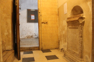
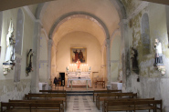

Pour les randonneurs, [voici un lien utile](https://www.visorando.com/randonnee-flaux.html "parcours")

# Notre église:

{:class="img-responsive"}  

{:class="img-responsive"}   

{:class="img-responsive"}  

{:class="img-responsive"}   

{:class="img-responsive"}  

{:class="img-responsive"}  

  
  
Tombeau Gallo Romain dans l'église de Flaux

  
  
Traduction Inscription Tombeau

  
  
Eglise de Flaux

 

  
  
Vitrail de l'église de Flaux

  
  
Vitrail de l'église de Flaux

  
  
Intérieur de l'église de Flaux

