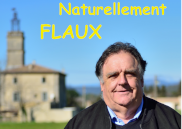

# L'engagement de notre maire, Denis JUVIN: 

{:class="img-responsive"}

Lors des élections de l’année 2020:

> Depuis 2001, j’ai l’honneur de servir notre village en tant que 1er adjoint du conseil municipal de Flaux présidé par Madame la Maire sortante, Nicole PEREZ. Suite à sa décision de ne pas se représenter aux élections municipales, j’ai décidé de poursuivre mon investissement au sein de notre commune en me présentant en tant que Maire.

> Fort de dix-neuf années d’expériences au sein du conseil municipal, c’est avec beaucoup de détermination, de conviction et d’amour pour notre village que je me présente en temps que tête de liste afin de représenter aux mieux nos intérêts. Une municipalité ne se gère pas seul et c’est avec une équipe diversifiée, représentative et citoyenne que je souhaite poursuivre la transformation durable de Flaux. Cette équipe est une équipe mixte composée de six femmes et cinq hommes, issus de différentes catégories socio-professionnelles et représentant géographiquement la commune.

> Ensemble, nous entendons poursuivre le développement de la commune et le travail engagé depuis plusieurs années par la municipalité. Nos valeurs sont des valeurs de respect, de bien vivre ensemble, de service de l’intérêt général et d’écoute des habitants afin d’œuvrer collectivement pour l’avenir de notre village.
Ensemble, nous mettrons en œuvre des projets fiables, durables et réalistes tout en restant attentifs à vos besoins et à vos attentes. Nous travaillerons en concertation avec vous et veillerons à maintenir une communication transparente par le biais d’informations régulières, de réunions citoyennes et de commissions mixtes composées d’élus et d’habitants.
Naturellement Flaux est une équipe engagée et soucieuse du développement et de l’avenir de notre commune. Nous proposons ainsi un programme que nous voulons intergénérationnel et adapté à l’identité et aux besoins du village et de ses habitants.

> En tant que tête de liste de « Naturellement Flaux », je suis d’ors et déjà à votre disposition pour échanger sur nos projets et répondre à vos questions. Soyez assurés, chères concitoyennes, chers concitoyens de mon attachement et de mon engagement total pour Flaux.

## Notre projet 2020 – 2026

Promouvoir le lien social et les initiatives collectives
* En soutenant les associations sportives et culturelles.
* En poursuivant l'investissement et l'implication pour la bibliothèque de Flaux.
* En restant actif au sein du Regroupement Scolaire pour en maintenir la qualité.
* En instaurant des rencontres et des moments d’échanges conviviaux avec nos aînés.
* En facilitant la participation citoyenne sur des projets collectifs pour le bien-être de tous.
* En créant un lieu de rencontre et de jeux pour les enfants.
* En aménageant le centre du village et en valorisant le patrimoine existant.

Favoriser une transition vers un équilibre environnemental durable
* En favorisant des projets de développement durable.
* En installant une borne électrique de recharge des voitures.
* En poursuivant les mesures de consommation raisonnée et les économies d’énergie (éclairage) et l’enfouissement des lignes électriques.
* En préservant les espaces forestiers et de garrigue :
** Poursuivre le plan de gestion de la forêt avec L’ONF.
** Protéger le village contre les incendies.

Maitriser le budget et les dépenses
* En poursuivant une gestion saine des finances communales.
* En échelonnant par priorité les investissements et en recherchant les modes de financement les plus adaptés. Contribuer à l’intercommunalité
* En participant activement à la politique conduite par la CCPU. (Communauté de communes Pays d’Uzès).

Promouvoir et soutenir notre agriculture et nos activités commerciales
* En maintenant et en favorisant l’installation des activités touristiques, commerciales et artisanales et les services de proximité.
* En soutenant l'agriculture locale.

Organiser une urbanisation raisonnée
* En veillant à une croissance maitrisée du village en tenant compte des contraintes de réseaux, de capacité de production de l’eau et de traitement des eaux usées.
* En travaillant en étroite collaboration avec l’administration pour faire aboutir le PPRI (Plan de Protection des Risques Inondation) et permettre ainsi à la commune de sortir de son classement en zone inondable. (Valorisation du patrimoine de chacun)
* En poursuivant la sécurisation de la traversée du village.

Maitriser nos consommations d’eau et préserver une gestion locale
* En garantissant la qualité de l’eau et en favorisant les actions d’économies (lutte contre les fuites, ..).
* En réalisant une étude de faisabilité de l’augmentation de la capacité de stockage de l’eau au travers du schéma directeur de l’eau.
* En œuvrant pour conserver la régie de l’eau. Moderniser nos moyens de communication
* En mettant en place différents outils de communication plus interactifs. (Site internet communal, affichage public ...)
* En améliorant la signalétique urbaine.

