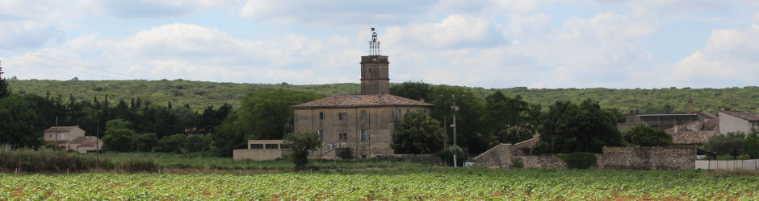

# Test H1
Some nice text here...

## Test H2
Some more text.

### Test H3

Some text.

* A bullet list item
* Another bullet list item

1. A numbered list
2. Another numbered list point

**Inline responsive image:**

{:class="img-responsive"}

Normal text looks like this.

> A quote from somebody.

**Some bold text.**

_Some itallic text._
